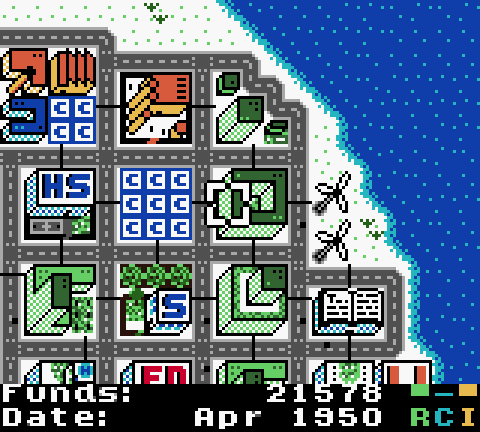
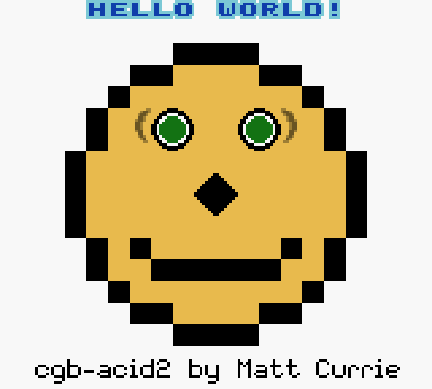

# gameboy

A Game Boy / Game Boy Color emulator written in C11. No required dependencies.

<div align="center">


</div>

## Features

- SM83 CPU: all 256 base + 256 CB opcodes
- Full PPU for DMG and CGB
- 4-channel APU: two square waves, wave, noise
- MBC1, MBC2, MBC3 (RTC), MBC5, HuC1
- Battery saves, 10 save-state slots
- Built-in debugger, disassembler, CPU tracing, headless mode

## Build

```bash
make
```

No dependencies to install. The build auto-detects SDL2 and X11; if neither is present
it still builds and `--headless` works. For the nicer SDL2 backend:

```bash
sudo apt install libsdl2-dev
```

Other targets:

```bash
make debug   # -O0 -g3
make asan    # AddressSanitizer + UBSan
make test    # full conformance suite
make clean
```

## Run

```bash
./bin/gameboy roms/homebrew/ucity.gbc
```

| Option | Meaning |
|---|---|
| `-s N` | window scale, 1..8 (default 4) |
| `-m dmg\|cgb\|auto` | force the hardware model |
| `-p N` | initial DMG palette |
| `-d` | start in the debugger |
| `-t FILE` | write a CPU trace |
| `--headless` | no window, run flat out |
| `--frames N` | stop after N frames |
| `--screenshot PATH` | save the final frame as a PNG |

Run `./bin/gameboy --help` for the full option list.

## Controls

| Key | Action | Key | Action |
|---|---|---|---|
| Arrows | D-pad | F1 / F2 | save / load state |
| X or N | A | F3 / F4 | save slot prev / next |
| Z or M | B | C | cycle DMG palette |
| Enter | Start | 0 | mute |
| Backspace | Select | - / = | volume down / up |
| Space (hold) | turbo | F12 | screenshot |
| P | pause | `` ` `` | debugger |
| R | reset | F11 | fullscreen |
| Esc / Q | quit | | |

A USB gamepad works automatically with the SDL2 backend.

## Testing

```bash
make test
```

Blargg's ROMs report results three ways, and the emulator reads all three:

```bash
# serial port
./bin/gameboy --headless --serial --break-on-serial-done roms/tests/cpu_instrs/cpu_instrs.gb

# cartridge RAM
./bin/gameboy --headless --memresult roms/tests/mem_timing-2/mem_timing.gb

# drawn on screen
./bin/gameboy --headless --frames 700 --screenshot /tmp/halt.png roms/tests/halt_bug.gb
```

## Accuracy

- `cpu_instrs`: 11/11
- `instr_timing`, `mem_timing`, `mem_timing-2`, `halt_bug`, `interrupt_time`: pass
- `dmg-acid2`, `cgb-acid2`: 0 differing pixels against the hardware reference
- `dmg_sound` / `cgb_sound`: see `docs/TEST_RESULTS.md`

## Debugger

Press `` ` `` in the window, or start with `-d`.

```
(gb) b 0150       set a breakpoint
(gb) dis 0100 8   disassemble
(gb) m c000 64    hexdump
(gb) s 5          single-step
(gb) c            continue
```

## Project layout

```
include/   public headers
src/       emulator core and platform backends
tools/     conformance runner
roms/      test ROMs and homebrew
docs/      screenshots and extra notes
```

## References

- [Pan Docs](https://gbdev.io/pandocs/)
- [cinoop](https://cturt.github.io/cinoop.html)
- [Blargg's test ROMs](https://github.com/retrio/gb-test-roms)
- [dmg-acid2](https://github.com/mattcurrie/dmg-acid2) / [cgb-acid2](https://github.com/mattcurrie/cgb-acid2)

## Licence

The emulator source is this project's own work. The bundled ROMs under `roms/` belong to
their respective authors and carry their own licences, see `roms/README.md`.
