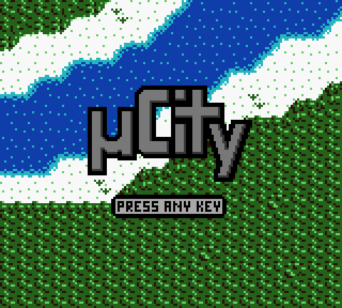
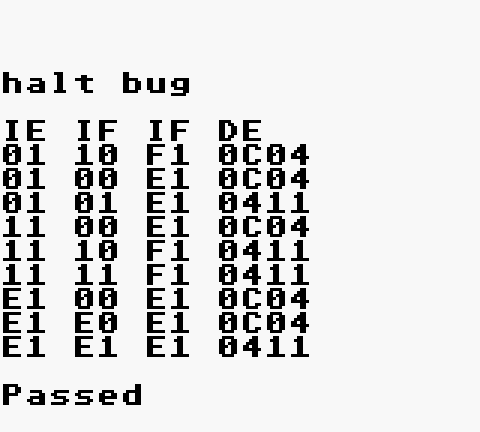
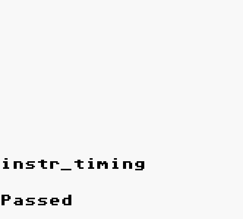
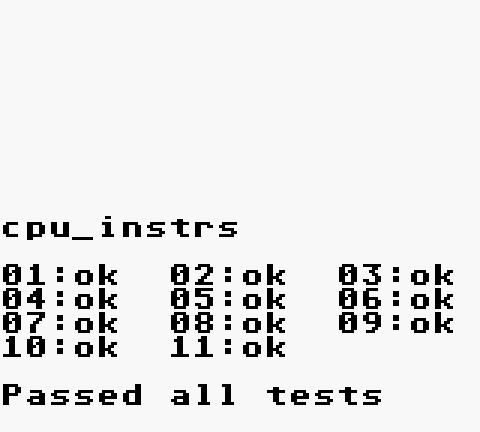
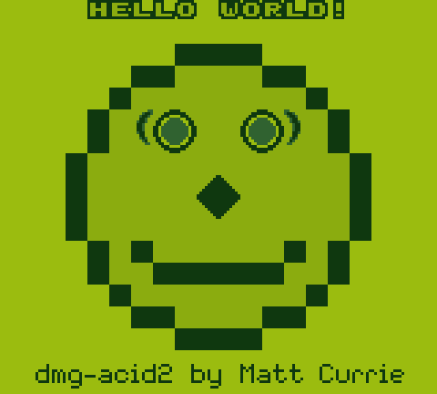

<div align="center">

# 🎮 gameboy

**A cycle-driven Game Boy / Game Boy Color emulator, written from scratch in C11.**

No required dependencies · Pixel-perfect on the standard conformance suites · Built-in debugger


<sub>µCity (CGB, MBC5) · cgb-acid2 PPU conformance — pixel-identical to real hardware</sub>

</div>

---

## Contents

- [What it does](#what-it-does)
- [Build](#build)
- [Run](#run)
- [Controls](#controls)
- [Command line](#command-line)
- [Testing](#testing) ← **how to verify it yourself**
- [Accuracy results](#accuracy-results)
- [Built-in debugger](#built-in-debugger)
- [How it works](#how-it-works)
- [Memory management](#memory-management)
- [Project layout](#project-layout)
- [References](#references)

---

## What it does

| | |
|---|---|
| **CPU** | Sharp SM83 — all 256 base + 256 CB opcodes, exact cycle counts, HALT bug, EI delay, interrupt priority |
| **Video** | Full PPU: background, window, sprites, 10-sprite-per-line limit, STAT interrupt blocking, mode-3 length variation |
| **Colour** | DMG with 5 selectable palettes, plus full CGB — palette RAM, VRAM banking, double speed, HDMA/GDMA |
| **Audio** | All 4 channels (2× square with sweep/envelope, wave, LFSR noise), 512 Hz frame sequencer, 48 kHz output |
| **Cartridges** | MBC1, MBC2, MBC3 (+ real-time clock), MBC5 (+ rumble bit), HuC1, plain ROM |
| **Persistence** | Battery saves (crash-safe), 10 save-state slots, versioned and ROM-checked |
| **Tooling** | Disassembler, interactive debugger, CPU tracing, PNG screenshots, headless mode with scripted input |

---

## Build

```bash
git clone https://github.com/MrpasswordTz/gameboy.git
cd gameboy
make
```

That's it. **Nothing needs installing.** The build detects what your system has:

| Backend | Requirement | Status |
|---|---|---|
| **SDL2** | `libsdl2-dev` | preferred — hardware scaling, vsync, gamepad support |
| **X11** | `libx11-dev` | already on every Kali/Debian desktop; uses MIT-SHM |
| **ALSA** | *nothing at all* | `libasound.so.2` is `dlopen`'d at runtime — no `-dev` package |

Check what was picked up:

```bash
make info
```

```
CC        = cc
SDL2      = yes
X11       = yes
sources   = 17 files
LDLIBS    = -lm -ldl -lpthread -lSDL2 -lX11 -lXext
```

If neither video backend exists the build still succeeds and `--headless` still works.
To get the nicer SDL2 path:

```bash
sudo apt install libsdl2-dev
```

Other targets:

```bash
make debug     # -O0 -g3, symbols for gdb
make asan      # AddressSanitizer + UndefinedBehaviorSanitizer
make test      # the full conformance suite
make clean
```

---

## Run

```bash
./bin/gameboy roms/homebrew/ucity.gbc
```

<div align="center">

</div>

On startup it prints what it found in the cartridge header:

```
-----------------------------------------------------------
 title        : MICROCITY
 mapper       : MBC5 (cart type 0x1B) +battery
 ROM          : 128 KiB (code 0x02)
 RAM          : 128 KiB (code 0x04)
 CGB flag     : 0xC0  CGB only
 header cksum : 0xD2  OK
 running as   : Game Boy Color, CGB features on
-----------------------------------------------------------
```

Scale the window up, force a hardware model, pick a palette:

```bash
./bin/gameboy -s 5 game.gb           # 5× window
./bin/gameboy -m dmg game.gbc        # run a colour cart as an original Game Boy
./bin/gameboy -p 2 game.gb           # start on palette 2
```

---

## Controls

| Key | Action | | Key | Action |
|---|---|---|---|---|
| **Arrows** | D-pad | | `F1` / `F2` | save / load state |
| `X` or `N` | A | | `F3` / `F4` | previous / next save slot |
| `Z` or `M` | B | | `C` | cycle DMG palette |
| `Enter` | Start | | `0` | mute |
| `Backspace` | Select | | `-` / `=` | volume down / up |
| `Space` *(hold)* | turbo | | `F12` | screenshot → PNG |
| `P` | pause | | `` ` `` | drop into the debugger |
| `R` | reset | | `F11` | fullscreen |
| `Esc` / `Q` | quit | | | |

A USB gamepad is picked up automatically when the SDL2 backend is in use.

---

## Command line

```
gameboy [options] <rom.gb>

  -s, --scale N          window scale 1..8                        (default 4)
  -m, --model dmg|cgb|auto   force the hardware model             (default auto)
  -b, --boot PATH        use a real boot ROM (256 or 2048 bytes)
  -p, --palette N        initial DMG palette
  -d, --debug            start in the debugger
  -t, --trace FILE       write a CPU trace ("-" for stdout)
      --raw-color        disable CGB colour correction (raw BGR555)
      --no-audio         disable sound
      --turbo            start with the frame limiter off

  headless / automation:
      --headless         no window, run flat out
      --frames N         stop after N frames
      --serial           echo serial-port bytes to stdout
      --break-on-serial-done   exit as soon as the serial log says Passed/Failed
      --memresult        read the verdict from cartridge RAM instead
      --screenshot PATH  write the final frame as a PNG
      --fbhash           print a SHA-1 of the final framebuffer
      --press LIST       scripted input, e.g. "120:start,180:a,240:down"
```

---

## Testing

The emulator is validated against the standard hardware conformance suites, which are
**bundled in `roms/tests/`** — nothing to download.

### Run everything

```bash
make test
```

### Run one suite by hand

Blargg's ROMs report their verdict in three different ways, and the emulator can read
all three.

**1. Over the serial port** — most of Blargg's tests:

```bash
./bin/gameboy --headless --serial --break-on-serial-done roms/tests/cpu_instrs/cpu_instrs.gb
```

```
cpu_instrs

01:ok  02:ok  03:ok  04:ok  05:ok  06:ok  07:ok  08:ok  09:ok  10:ok  11:ok

Passed all tests
```

Exit code is `0` for Passed, `1` for Failed — so it drops straight into CI.

**2. In cartridge RAM** — the `-2` variants:

```bash
./bin/gameboy --headless --memresult roms/tests/mem_timing-2/mem_timing.gb
```

```
mem_timing

01:ok  02:ok  03:ok

Passed
```

**3. Drawn on screen** — everything else. Capture it as a PNG and look:

```bash
./bin/gameboy --headless --frames 700 --screenshot /tmp/halt.png roms/tests/halt_bug.gb
```

<div align="center">


</div>

### Verify the PPU pixel-for-pixel

`dmg-acid2` and `cgb-acid2` draw a picture that exercises sprite priority, the
10-sprite-per-line limit, window quirks and LCDC edge cases. Render it and compare
against the published hardware capture:

```bash
./bin/gameboy --headless -m dmg --frames 120 --screenshot /tmp/mine.png roms/tests/dmg-acid2.gb
curl -sLo /tmp/ref.png https://raw.githubusercontent.com/mattcurrie/dmg-acid2/master/img/reference-dmg.png
# compare /tmp/mine.png against /tmp/ref.png
```

Use `--raw-color` for the CGB one, since the reference capture is raw BGR555 and the
emulator applies LCD colour correction by default.

### Check for leaks and undefined behaviour

```bash
make asan
./bin/gameboy-asan --headless --frames 600 roms/tests/cpu_instrs/cpu_instrs.gb

valgrind --leak-check=full --error-exitcode=1 \
  ./bin/gameboy --headless --frames 200 roms/homebrew/ucity.gbc
```

### Drive a real game from a script

`--press` presses buttons at given frame numbers, which makes screenshot regression
tests possible without a human:

```bash
./bin/gameboy --headless --frames 2400 \
  --press "150:start,300:down,400:a,700:a,900:a,1200:a" \
  --screenshot /tmp/city.png roms/homebrew/ucity.gbc
```

That is exactly how the gameplay screenshot at the top of this README was produced.

---

## Accuracy results

Everything below was run with the bundled ROMs on this build.

### CPU — Blargg `cpu_instrs`, 11/11

<div align="center">

</div>

| Test | | Test | |
|---|---|---|---|
| 01-special | ✅ | 07-jr,jp,call,ret,rst | ✅ |
| 02-interrupts | ✅ | 08-misc instrs | ✅ |
| 03-op sp,hl | ✅ | 09-op r,r | ✅ |
| 04-op r,imm | ✅ | 10-bit ops | ✅ |
| 05-op rp | ✅ | 11-op a,(hl) | ✅ |
| 06-ld r,r | ✅ | | |

### Timing and edge cases

| Test | Result | What it proves |
|---|---|---|
| `instr_timing` | ✅ Passed | every instruction's cycle count is exact |
| `mem_timing` | ✅ Passed | memory accesses land on the right cycle |
| `mem_timing-2` | ✅ Passed | …confirmed a second way, via cartridge RAM |
| `halt_bug` | ✅ Passed | the HALT-with-IME=0 PC quirk |
| `interrupt_time` | ✅ Passed | interrupt latency, including CGB double speed |

### PPU — pixel-perfect

Both acid2 ROMs match the published hardware reference captures with **zero differing
pixels out of 23 040**:

| | rendered | reference | diff |
|---|---|---|---|
| `dmg-acid2` |  | *(identical)* | **0 px** |
| `cgb-acid2` |  | *(identical)* | **0 px** |

> The CGB screenshot looks warmer than the raw reference because colour correction is on
> by default — the real CGB panel is much less saturated than an sRGB monitor. Pass
> `--raw-color` to get the literal BGR555 values, which is what the byte-for-byte
> comparison above uses.

### Audio — Blargg `dmg_sound`

These are the strictest APU tests in existence and deliberately target obscure hardware
quirks. Current state of the 12 individual ROMs is recorded in
[`docs/TEST_RESULTS.md`](docs/TEST_RESULTS.md); normal game audio is unaffected by the
remaining edge cases.

---

## Built-in debugger

Press `` ` `` in the window, or start with `-d`:

```
(gb) r
 A:01 F:B0 [Z-HC]  B:00 C:13  D:00 E:D8  H:01 L:4D
 SP:FFFE PC:0100   IME:0  IE:00 IF:E1
 LCDC:91 STAT:85 LY:00   ROM bank:1   cyc=23440612

(gb) b 0150             set a breakpoint
(gb) dis 0100 8         disassemble
 0100: NOP
 0101: JP $0150
 0104: DB $CE
(gb) m c000 64          hexdump with an ASCII column
(gb) s 5                single-step, printing a trace line each time
(gb) n                  step over a CALL
(gb) c                  continue
```

Trace output uses the Gameboy Doctor / BGB layout, so a run can be diffed line by line
against a reference log:

```bash
./bin/gameboy --headless -t trace.log --frames 10 game.gb
```

```
A:01 F:B0 B:00 C:13 D:00 E:D8 H:01 L:4D SP:FFFE PC:0100 PCMEM:00,C3,50,01  NOP  ; cyc=0
```

---

## How it works

### The timing model

The whole emulator hangs off one rule, fixed in [`include/gb.h`](include/gb.h):

> **`mmu_read` and `mmu_write` each burn one M-cycle by calling `gb_tick(gb, 4)` *before*
> performing the bus access.**

So the PPU, timer, APU and DMA engines all observe memory traffic at the moment it
actually happens, rather than being caught up in a lump at the end of the instruction.
The CPU adds ticks only for genuinely *internal* cycles — the extra cycle in `PUSH`, a
taken conditional branch, `ADD HL,rr`.

`mmu_peek`/`mmu_poke` are the non-ticking twins. DMA, the PPU and the debugger use those,
so nothing ever re-enters the tick fan-out.

Instruction cost is **measured, not looked up**: `cpu_step` records `gb->cycles` on entry
and returns the delta. A hand-written timing table can silently disagree with what the
code actually did; a measured delta cannot.

```
cpu_step()
   └── mmu_read(pc++)              ← gb_tick(4), then fetch
         └── gb_tick(4)
               ├── timer_tick      ┐ CPU clock — these double under
               ├── serial_tick     │ CGB double speed
               ├── mmu_tick_dma    ┘
               ├── ppu_tick        ┐ fixed 4.19 MHz — divided back
               ├── apu_tick        │ down by the speed multiplier
               └── cart_tick_rtc   ┘
```

### The timer

`DIV` is modelled as the real 16-bit counter it is, with the `DIV` register reading its
top byte. `TIMA` increments on the **falling edge** of a selected `DIV` bit ANDed with
the `TAC` enable, and the counter is advanced one T-cycle at a time so no edge is missed.

That structure makes the awkward cases fall out for free rather than needing special
cases: writing `DIV` resets the counter and can itself drop the watched bit, producing a
spurious `TIMA` increment. Writing `TAC` can do the same by disabling the timer while the
bit is high. Both just re-run the same edge check.

### STAT interrupts

All four STAT sources feed **one logical line**, and the interrupt fires only on its
*rising* edge. That is what "STAT blocking" actually is — modelling it as a level instead
of an edge is what drowns games in spurious interrupts.

---

## Memory management

The assignment's stated goal was understanding memory, so this got deliberate attention.

**One allocation per lifetime, freed on exactly one path.**

* The entire machine is a single heap-allocated `struct GB` (273 KiB). VRAM, WRAM, HRAM,
  OAM, palette RAM, wave RAM, the audio ring and the framebuffer are all fixed-size
  members — there is nothing inside it to leak.
* Exactly three things are separately owned: the cartridge ROM image, the cartridge RAM
  image, and an optional boot ROM. Each has one owner and is released by `cart_unload()` /
  `gb_destroy()`, both safe on NULL and safe to call twice.
* **Every index derived from guest data is masked or bounds-checked.** ROM banks are
  masked against the real bank count, VRAM/OAM/HRAM/palette/wave indices are masked to
  their array sizes, and `cart_read_rom` range-checks against the allocated size before
  indexing. A corrupt or hostile ROM cannot read or write outside its buffers.
* **Save states can't smuggle pointers.** Saving copies the struct and blanks the pointer
  fields in the copy; loading restores the blob and then immediately writes the *live*
  pointers back over whatever came out of the file. The header also carries the ROM size
  and cartridge header checksum, both verified before anything is restored.
* **Battery saves are crash-safe**: written to a temp file and `rename()`d into place, so
  a crash part-way through cannot destroy the previous save.
* The audio ring is single-producer / single-consumer — only the emitter moves the write
  index, only the consumer moves the read index — and it *drops* rather than blocks, so
  the emulation thread can never stall on audio.

Verify:

```bash
make asan && ./bin/gameboy-asan --headless --frames 600 roms/tests/cpu_instrs/cpu_instrs.gb
valgrind --leak-check=full ./bin/gameboy --headless --frames 200 roms/homebrew/ucity.gbc
```

The whole core also compiles clean under
`-Wall -Wextra -Wshadow -Wpointer-arith -Wcast-align -Wstrict-prototypes -Wmissing-prototypes`
with **zero warnings**.

---

## Project layout

```
include/gb.h              the contract: machine state + every inter-module entry point
include/platform.h        host abstraction (video / input / audio)

src/cpu.c                 256 base opcodes, interrupts, HALT bug, EI delay
src/cpu_cb.c              256 CB-prefixed opcodes
src/mmu.c                 memory map, I/O dispatch, OAM DMA, CGB HDMA/GDMA
src/cart.c                header parsing, MBC1/2/3/5 + HuC1, RTC, battery saves
src/ppu.c                 scanline renderer, mode FSM, DMG + CGB colour
src/apu.c                 4 channels, frame sequencer, resampler, ring buffer
src/timer.c               DIV/TIMA falling-edge timer
src/joypad.c              P1 button matrix
src/serial.c              link port (test ROMs report results here)
src/savestate.c           versioned, ROM-checked save states
src/debugger.c            disassembler + interactive REPL
src/main.c                CLI, main loop, frame pacing, hotkeys
src/platform/plat_sdl.c   SDL2 backend
src/platform/plat_x11.c   Xlib + MIT-SHM backend
src/platform/audio_alsa.c ALSA via dlopen — no dev headers needed
src/platform/plat_common.c backend selection, timing, dependency-free PNG writer

tools/run_tests.sh        headless conformance runner
roms/tests/               Blargg + acid2 conformance ROMs
roms/homebrew/            uCity, a real GPL-3 game to try
docs/screenshots/         the images in this README
```

---

## References

* [Pan Docs](https://gbdev.io/pandocs/) — the authoritative hardware reference
* [cinoop](https://cturt.github.io/cinoop.html) — the write-up this assignment pointed at
* [Blargg's test ROMs](https://github.com/retrio/gb-test-roms)
* [dmg-acid2](https://github.com/mattcurrie/dmg-acid2) / [cgb-acid2](https://github.com/mattcurrie/cgb-acid2) — PPU conformance
* [The Game Boy Advance architecture](https://www.copetti.org/writings/consoles/game-boy-advance/) — Rodrigo Copetti

## Licence

The emulator source is this project's own work. The bundled ROMs under `roms/` belong to
their respective authors and carry their own licences — see [`roms/README.md`](roms/README.md).
